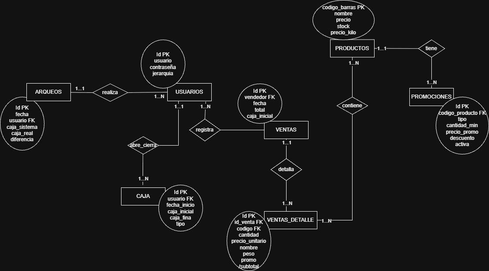
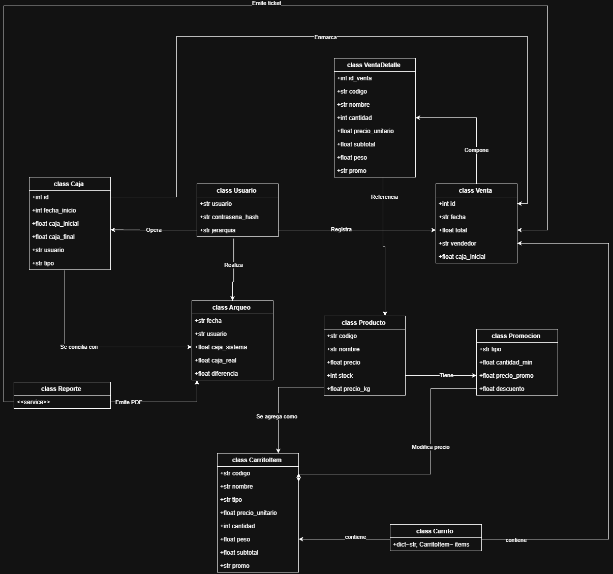

# Sistema Minimarket V&E

> Sistema de punto de venta (POS) de escritorio para pequeños comercios minoristas. Desarrollado íntegramente en Python con interfaz gráfica moderna, base de datos local embebida y soporte para distribución como ejecutable standalone sin dependencias externas.

---

## Índice

1. [Descripción general](#descripción-general)
2. [Capturas de pantalla](#capturas-de-pantalla)
3. [Funcionalidades](#funcionalidades)
4. [Stack tecnológico](#stack-tecnológico)
5. [Arquitectura](#arquitectura)
6. [Base de datos](#base-de-datos)
7. [Sistema de seguridad](#sistema-de-seguridad)
8. [Instalación y uso](#instalación-y-uso)
9. [Empaquetado como ejecutable](#empaquetado-como-ejecutable)
10. [Autor](#autor)

---

## Descripción general

**Minimarket V&E** es un POS (Point of Sale) de escritorio pensado para el día a día de un comercio minorista. Corre 100% offline en Windows, persiste sus datos en SQLite y puede distribuirse como un único `.exe` sin necesitar Python instalado en la máquina destino.

El sistema resuelve el ciclo completo de operación de caja:

```
Login → Apertura de caja → Ventas del turno → Arqueo → Cierre
```

Cada venta registra stock, genera ticket imprimible y actualiza el saldo de caja en tiempo real. Los informes permiten reconstruir cualquier período con filtro por fecha y vendedor.

---

## Capturas de pantalla

> *Las capturas corresponden a la interfaz vigente con CustomTkinter.*

| Pantalla | Descripción |
|---|---|
| **Login** | Panel oscuro con logo y formulario centrado |
| **Ventana principal** | Sidebar colapsable + campo de código + carrito en tiempo real + totales |
| **Gestión** | Tabla de productos con búsqueda fuzzy + formularios de ABM |
| **Informe** | Tabla cronológica de ventas y movimientos con caja calculada |
| **Arqueo** | Formulario de cierre con diferencia sistema vs. real |

---

## Funcionalidades

### Módulo de venta

- **Ingreso por código de barras** — campo siempre enfocado, acepta lectura de pistola o teclado numérico
- **Productos por unidad** — suma 1 unidad por escaneo; stock validado contra DB en tiempo real
- **Productos por peso (granel)** — modal `KgWindow` para ingresar kilos; precio calculado como `peso × precio/kg`
- **Carrito en tiempo real** — tabla con código, nombre, cantidad/peso, precio unitario y subtotal; se refresca en cada operación
- **Promociones automáticas** — evaluadas al agregar al carrito, sin intervención manual:
  - `cantidad`: N unidades al precio especial (ej. 3 x $150)
  - `peso`: precio/kg diferencial si el peso supera el mínimo
  - `porcentaje`: descuento porcentual sobre el subtotal del ítem
- **Descuento global por venta** — porcentaje opcional que se aplica sobre el total antes de cobrar
- **Cálculo de vuelto** — ingreso del monto recibido, validación de pago suficiente, resultado en pantalla
- **Eliminar 1 unidad** — reduce en 1 la cantidad del ítem seleccionado
- **Eliminar ítem completo** — remueve el ítem entero del carrito
- **Finalizar compra** — registra la venta y limpia el carrito para la siguiente transacción

### Módulo de caja

- **Apertura de caja** — al iniciar sesión se solicita el monto inicial; queda registrado con fecha y usuario
- **Actualizar caja** — suma o resta montos manuales (retiros, depósitos, cambio de billetería)
- **Saldo en tiempo real** — cada venta registrada incrementa el saldo acumulado

### Módulo de arqueo

- **Registrar arqueo** — el cajero ingresa la caja contada; el sistema calcula la diferencia respecto al saldo teórico (positivo = sobrante, negativo = faltante)
- **Consultar arqueos** — filtro por rango de fechas y usuario, tabla con todos los registros
- **Exportar** — genera archivo TXT listo para imprimir

### Módulo de gestión (solo admin)

- **Catálogo de productos** — tabla con código de barras, nombre, precio unitario, precio/kg y stock
- **Búsqueda inteligente** — filtra por código o nombre con ranking por similitud (`difflib.SequenceMatcher`)
- **Agregar producto** — código, nombre, precio, stock inicial y precio/kg (opcional para granel)
- **Actualizar producto** — modificar precio, precio/kg y stock de forma individual o conjunta en un único formulario
- **Eliminar producto** — confirmación obligatoria antes de borrar
- **Gestionar usuarios** — alta y baja de operadores con rol y contraseña hasheada
- **Gestionar promociones** — acceso directo a `PromosWindow` desde la misma ventana

### Módulo de promociones (solo admin)

- **Crear / editar / eliminar** reglas de promoción por código de producto
- **Tipos soportados:** `cantidad`, `peso`, `porcentaje`
- **Activar / desactivar** sin necesidad de eliminar la regla
- Tabla completa con todas las promos vigentes y filtrable

### Módulo de informes

- **Filtro flexible** — rango completo: año, mes, día y hora (desde/hasta); vendedor opcional
- **Vista unificada** — mezcla cronológica de ventas y movimientos de caja en una misma tabla
- **Caja calculada** — muestra caja inicial del período, total de ventas y caja final resultante
- **Detalle de venta** — doble clic / botón muestra los ítems de esa venta con cantidad, precio y promo
- **Eliminar venta** — solo admin, con confirmación; útil para corregir errores del turno
- **Exportar a TXT** — informe formateado, se abre automáticamente en el Bloc de Notas

### Ticket de venta

- **Formato para impresora de rollo** — ancho fijo de 47 caracteres
- **Contenido:** cabecera con fecha/hora, líneas por ítem (con promo si aplica), subtotal, descuento, total, vuelto entregado
- **Pie de página:** leyenda "Documento no válido como factura"
- Generado como TXT y abierto con el programa predeterminado del sistema

### Seguridad y acceso

- **Login con validación** — usuario y contraseña; bloquea acceso ante credenciales incorrectas
- **Dos roles:** `admin` (acceso total) y `cajero` (solo venta, arqueos e informes)
- **Contraseñas hasheadas** — PBKDF2-HMAC-SHA256 con 260 000 iteraciones y salt de 256 bits
- **Migración automática** — contraseñas en texto plano del sistema anterior se re-hashean en el primer login sin acción del usuario

---

## Stack tecnológico

| Componente | Tecnología | Notas |
|---|---|---|
| Lenguaje | **Python 3.10+** | Tipado estático, dataclasses, match-case |
| Interfaz gráfica | **CustomTkinter 5.x** | Widgets modernos sobre Tkinter, DPI-aware en Windows 11 |
| Tablas y listas | **tkinter.ttk Treeview** | Estilizado con tema Clam + paleta personalizada |
| Base de datos | **SQLite3** (stdlib) | FK activas, transacciones atómicas, `get_db()` context manager |
| Imágenes | **Pillow** | Carga y redimensionado del logo |
| Hash de contraseñas | **hashlib** (stdlib) | PBKDF2-HMAC-SHA256, 260 000 iteraciones |
| Distribución | **PyInstaller** | Genera `.exe` standalone para Windows |

**Dependencias externas instalables:**

```
customtkinter
pillow
```

Sin frameworks web, sin ORMs, sin dependencias pesadas. El sistema completo arranca con dos `pip install`.

---

## Arquitectura

### Estructura de carpetas

```
SistemaMinimarket/
├── main.py                      # Entry point — inicializa CTk y abre el login
├── exceptions.py                # Jerarquía de excepciones de dominio
├── LOGO.jpg                     # Logotipo del local
│
├── gui/                         # Capa de presentación (CustomTkinter)
│   ├── theme.py                 # Paleta de colores, fuentes y helpers de estilo
│   ├── login_window.py          # Pantalla de autenticación
│   ├── main_window.py           # Ventana principal POS con sidebar colapsable
│   ├── gestion_window.py        # ABM de productos y usuarios
│   ├── promos_window.py         # Gestión de promociones
│   ├── caja_window.py           # Apertura y actualización de caja
│   ├── arqueo_window.py         # Registro y consulta de arqueos
│   ├── informe_window.py        # Filtrado y resultados de informes
│   ├── kg_window.py             # Modal de ingreso de peso
│   └── ticket_window.py         # Generación e impresión de ticket
│
├── core/                        # Lógica de negocio (sin SQL, sin GUI)
│   ├── venta_service.py         # Máquina de estados del carrito (VentaService)
│   ├── logic_ventas.py          # Subtotales, totales, evaluación de promociones
│   ├── logic_login.py           # Validación de credenciales
│   ├── logic_gestion.py         # Cálculos de stock y precios
│   ├── logic_arqueos.py         # Búsqueda y sumatorias de arqueos
│   ├── logic_informe.py         # Procesamiento de caja base y totales del período
│   ├── logic_ticket.py          # Formato textual del recibo
│   ├── security.py              # Hash PBKDF2 y migración de contraseñas
│   └── validar.py               # Validación del peso ingresado en KgWindow
│
├── database/                    # Capa de acceso a datos (DAO)
│   ├── connection.py            # get_db() context manager + PRAGMA FK + resource_path
│   ├── productos_db.py          # CRUD de productos y búsqueda de promociones
│   ├── ventas_db.py             # Registro atómico de ventas + descuento de stock
│   ├── login_db.py              # CRUD de usuarios
│   ├── caja_db.py               # Apertura y actualización de saldo de caja
│   ├── arqueo_db.py             # Inserción y filtrado de arqueos
│   ├── informe_db.py            # Queries para reportes (UNION ventas + movimientos)
│   └── promos_db.py             # CRUD de promociones
│
├── models/                      # Dataclasses de dominio
│   ├── producto.py              # Producto (con propiedad es_por_peso)
│   ├── carrito.py               # CarritoItem + type alias Carrito
│   └── promocion.py             # Promocion
│
└── reports/                     # Generación y exportación de reportes
    ├── ticket_generator.py      # Formatea el recibo de venta como TXT
    ├── arqueo_report.py         # Exporta tabla de arqueos a TXT
    └── informe_report.py        # Exporta informe de movimientos a TXT
```

## 📐 Arquitectura y Diseño del Sistema

### Diagrama Entidad-Relación Conceptual (Modelo de Chen)
Refleja la persistencia y relaciones lógicas del sistema sobre la base de datos SQLite.



---

### Modelo de Dominio (Diagrama de Clases UML)
Representa la lógica de negocio en la capa core del sistema (Usuarios, Ventas, Carrito y Reglas de Promociones).



### Capas y responsabilidades

```
┌─────────────────────────────────────────────────┐
│  GUI  (gui/)                                    │
│  CustomTkinter — solo presentación              │
│  No accede a DB directamente                    │
└────────────────────┬────────────────────────────┘
                     │ llama a
┌────────────────────▼────────────────────────────┐
│  Core  (core/)                                  │
│  Lógica pura — sin SQL, sin widgets             │
│  VentaService: único dueño del estado           │
└────────────────────┬────────────────────────────┘
                     │ llama a
┌────────────────────▼────────────────────────────┐
│  Database  (database/)                          │
│  SQL puro — sin decisiones de negocio           │
│  get_db() garantiza FK + commit/rollback        │
└────────────────────┬────────────────────────────┘
                     │ opera sobre
┌────────────────────▼────────────────────────────┐
│  SQLite3  (%APPDATA%\SistemaMinimarketVE\)       │
└─────────────────────────────────────────────────┘
```

### Decisiones de diseño relevantes

**Transacción atómica en ventas**
El carrito vive completamente en memoria durante el turno. Al finalizar la compra, `registrar_venta()` abre una única conexión SQLite y, dentro de una sola transacción, valida stock, decrementa unidades e inserta cabecera + detalle de venta. Si cualquier operación falla (stock insuficiente, error de IO, etc.), SQLite hace rollback y la base de datos no cambia.

**Foreign Keys activas**
Cada llamada a `get_db()` ejecuta `PRAGMA foreign_keys = ON` antes de entregar la conexión. Esto garantiza integridad referencial entre `ventas` y `ventas_detalle` en todo momento, incluso en el ejecutable empaquetado.

**Sidebar colapsable con animación fluida**
El sidebar de la ventana principal arranca en 62 px (solo íconos). Al pasar el mouse se expande animado a 224 px mostrando ícono + etiqueta. La animación usa `after()` frame a frame. Para evitar el falso positivo de `<Leave>` al moverse entre botones hijos, el colapso tiene un delay de 90 ms seguido de verificación real de posición con `winfo_pointerxy()`.

**Promociones en tiempo real**
Las promociones se evalúan al agregar cada ítem al carrito, no al finalizar. `calcular_subtotal_item()` aplica la lógica de packs, precio/kg especial o descuento porcentual y devuelve el subtotal ajustado junto con una descripción de la promo aplicada.

---

## Base de datos

La base se almacena fuera del directorio del proyecto para sobrevivir reinstalaciones del ejecutable:

```
%APPDATA%\SistemaMinimarketVE\productos.db
```

Se crea automáticamente con el esquema completo y el usuario `admin` en el primer arranque.

### Esquema de tablas

**`productos`** — Catálogo de artículos

| Columna | Tipo | Descripción |
|---|---|---|
| `codigo_barras` | TEXT PK | Código único del artículo |
| `nombre` | TEXT | Nombre visible en el carrito |
| `precio` | REAL | Precio unitario |
| `stock` | INTEGER | Unidades disponibles |
| `PrecioKilo` | REAL | Precio por kg (NULL en artículos por unidad) |

**`usuarios`** — Operadores del sistema

| Columna | Tipo | Descripción |
|---|---|---|
| `id` | INTEGER PK | Autoincremental |
| `usuario` | TEXT UNIQUE | Nombre de usuario |
| `contrasena` | TEXT | Hash PBKDF2-SHA256 |
| `jerarquia` | TEXT | `admin` o `cajero` |

**`ventas`** — Cabecera de cada transacción

| Columna | Tipo | Descripción |
|---|---|---|
| `id` | INTEGER PK | Autoincremental |
| `fecha` | TEXT | `YYYY-MM-DD HH:MM:SS` |
| `total` | REAL | Monto final cobrado (con descuento) |
| `vendedor` | TEXT | Usuario que realizó la venta |
| `caja_inicial` | REAL | Saldo de caja al momento de registrar |

**`ventas_detalle`** — Líneas de venta

| Columna | Tipo | Descripción |
|---|---|---|
| `id` | INTEGER PK | Autoincremental |
| `id_venta` | INTEGER FK | Referencia a `ventas.id` |
| `codigo` | TEXT | Código del producto |
| `nombre` | TEXT | Nombre al momento de la venta |
| `cantidad` | INTEGER | Unidades (NULL en productos por peso) |
| `peso` | REAL | Peso en kg (NULL en productos por unidad) |
| `precio_unitario` | REAL | Precio base sin promo |
| `subtotal` | REAL | Total del ítem con promo aplicada |
| `promo` | TEXT | Descripción de la promoción (o NULL) |

**`promociones`** — Reglas de precio especial

| Columna | Tipo | Descripción |
|---|---|---|
| `id` | INTEGER PK | Autoincremental |
| `codigo_producto` | TEXT | Producto al que aplica |
| `tipo` | TEXT | `cantidad`, `peso` o `porcentaje` |
| `cantidad_min` | INTEGER | Umbral mínimo para activar |
| `precio_promo` | REAL | Precio especial (tipos cantidad/peso) |
| `descuento` | REAL | Porcentaje de descuento (tipo porcentaje) |
| `activa` | INTEGER | `1` activa, `0` desactivada |

**`caja`** — Historial de movimientos de caja

| Columna | Tipo | Descripción |
|---|---|---|
| `id` | INTEGER PK | Autoincremental |
| `fecha_inicio` | TEXT | `YYYY-MM-DD HH:MM:SS` |
| `caja_inicial` | REAL | Monto antes del movimiento |
| `caja_final` | REAL | Monto después del movimiento |
| `usuario` | TEXT | Operador responsable |
| `tipo` | TEXT | `INICIAL` o `MOVIMIENTO` |

**`arqueos`** — Registros de arqueo por turno

| Columna | Tipo | Descripción |
|---|---|---|
| `id` | INTEGER PK | Autoincremental |
| `fecha` | TEXT | `YYYY-MM-DD HH:MM:SS` |
| `usuario` | TEXT | Cajero que realizó el arqueo |
| `caja_sistema` | REAL | Saldo teórico calculado |
| `caja_real` | REAL | Efectivo contado físicamente |
| `diferencia` | REAL | `caja_real − caja_sistema` |

---

## Sistema de seguridad

### Hash de contraseñas

Las contraseñas se almacenan usando **PBKDF2-HMAC-SHA256**, el estándar recomendado por OWASP y utilizado por Django, con los siguientes parámetros:

| Parámetro | Valor |
|---|---|
| Algoritmo | PBKDF2-HMAC-SHA256 |
| Iteraciones | 260 000 |
| Salt | 32 bytes aleatorios por contraseña |
| Longitud del hash | 32 bytes |
| Formato almacenado | `pbkdf2:sha256:260000:<salt_hex>:<hash_hex>` |

### Migración automática

Las instalaciones que venían usando contraseñas en texto plano se migran automáticamente en el siguiente login exitoso, sin ninguna acción requerida por el administrador.

### Control de acceso por rol

| Funcionalidad | `cajero` | `admin` |
|---|---|---|
| Realizar ventas | ✓ | ✓ |
| Ver informes | ✓ | ✓ |
| Realizar arqueos | ✓ | ✓ |
| Actualizar caja | ✓ | ✓ |
| Gestionar productos | — | ✓ |
| Ajustar stock | — | ✓ |
| Gestionar usuarios | — | ✓ |
| Gestionar promociones | — | ✓ |
| Eliminar ventas del informe | — | ✓ |

---

## Instalación y uso

### Requisitos

- Windows 10 / 11 (64-bit)
- Python 3.10 o superior

### Pasos

```bash
# 1. Clonar el repositorio
git clone https://github.com/TomasAleart/SistemaMinimarket.git
cd SistemaMinimarket

# 2. Instalar dependencias
pip install customtkinter pillow

# 3. Ejecutar
python main.py
```

La base de datos se crea automáticamente en `%APPDATA%\SistemaMinimarketVE\productos.db` en el primer arranque.

### Credenciales por defecto

| Usuario | Contraseña | Rol |
|---|---|---|
| `admin` | `admin` | admin |

> Se recomienda cambiar la contraseña por defecto desde la ventana de Gestión tras el primer ingreso.

---

## Empaquetado como ejecutable

```bash
pip install pyinstaller

pyinstaller --onefile --windowed \
  --add-data "LOGO.jpg;." \
  --name "MinimarketVE" \
  main.py
```

El ejecutable `dist/MinimarketVE.exe` corre en cualquier PC con Windows sin necesitar Python instalado. La base de datos se crea en `%APPDATA%\SistemaMinimarketVE\` la primera vez que se ejecuta.

---

## Autor

**Tomás Aleart** — [tomasaleart@gmail.com](mailto:tomasaleart@gmail.com)

Proyecto de portfolio — sistema POS funcional desarrollado de cero, con foco en correctitud transaccional, separación de capas, seguridad de credenciales y empaquetado para producción real.
